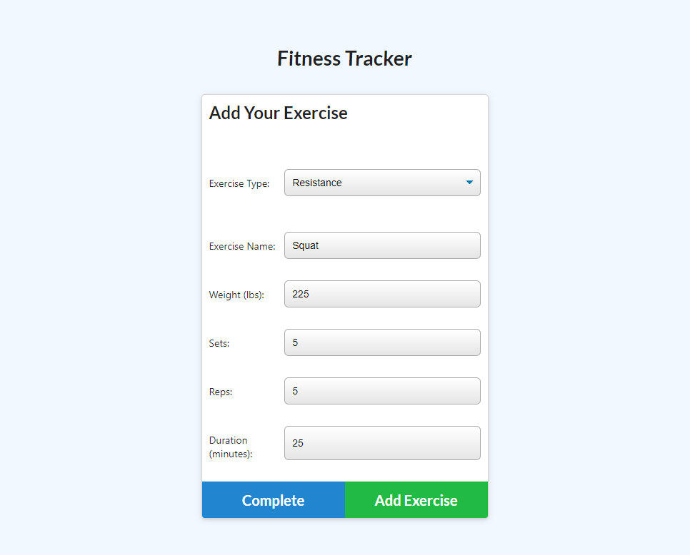
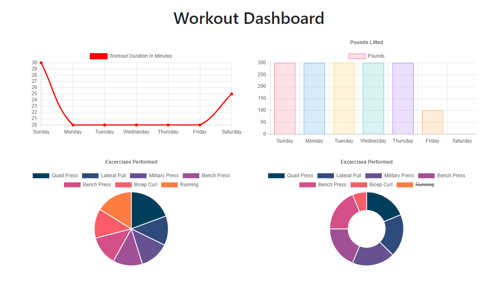

<!-- Iron Dojo - Track Your Strength -->

  <h3 align="center">Fitness Tracker</h3>

  

    A web application that allows your fitness routine.
     
    <a href="https://calm-garden-02997.herokuapp.com/"><strong>Link to Fitness Tracker»</strong></a>
     
  

<!-- TABLE OF CONTENTS -->
## Table of Contents

* [About the Project](#about-the-project)
  * [Built With](#built-with)
* [Visit the Site](#visitTheSite)
* [Usage](#usage)
* [Contributing](#contributing)
* [License](#license)
* [Contact](#contact)

<!-- ABOUT THE PROJECT -->
## About The Project

[Fitness Tracker](https://calm-garden-02997.herokuapp.com/)

Progression is a critical aspect of establishing progress during a fitness regime.  To effectively progress, one should to track their progress.  This web application allows a use to log and view a record of their fitness.  

### Built With
* [JavaScript](https://www.javascript.com/)
* [heroku](https://www.heroku.com/home)

## Visit The Site

Visit the live website at [Here](https://calm-garden-02997.herokuapp.com/)

## Usage

The primary purpose of this project is to log and track your exercise

1. Add Exercise
    

2. See Stats
    

## Contributing

Contributions for this web application was made by 
* [Ryan Durk](https://github.com/rpdurk), 

<!-- LICENSE -->
## License

MIT License
